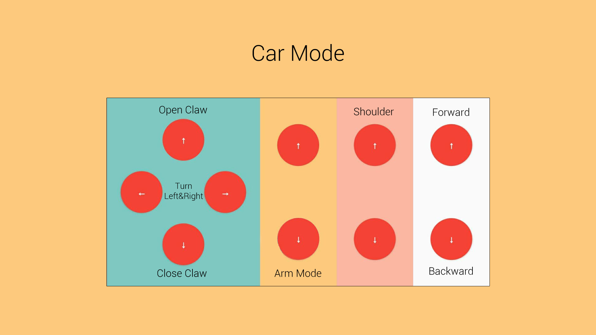

# arduino-bot
Arduino bluetooth controlled car with arm.

Board
- Arduino Uno R3
- L298P Motor Driver Shield

[Bluetooth Controller](https://play.google.com/store/apps/details?id=com.gecreative.allinonearduinocontroller&hl=en&gl=US)

